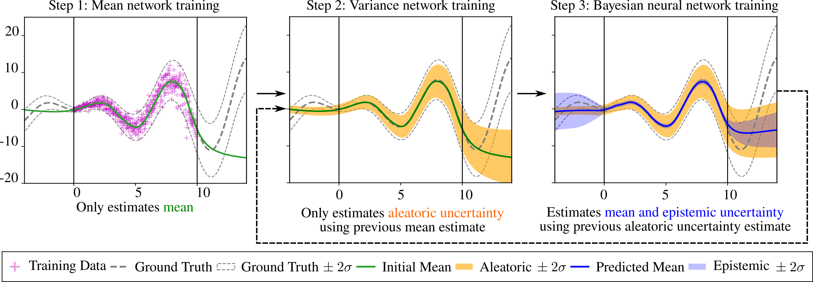

<p align="center">
  <a href=""></a>
</p>


# What is VeBNN?

| [**GitHub**](https://github.com/JiaxiangYi96/VeBNN)
| [**arXiv**](https://arxiv.org/abs/2505.02743) |

## Summary

`VeBNN` provides the implementation for the paper [Cooperative variance estimation and Bayesian neural networks disentangle aleatoric and epistemic uncertainties](https://arxiv.org/abs/2505.02743).


## Statement of need

Real-world data contains **aleatoric uncertainty** — irreducible noise caused by imperfect measurements or incomplete knowledge of the data-generating process. Mean variance estimation (MVE) networks can learn this type of uncertainty but require ad-hoc regularization strategies to avoid overfitting and are unable to predict epistemic uncertainty (model uncertainty). Conversely, Bayesian neural networks predict epistemic uncertainty but are notoriously difficult to train due to the approximate nature of Bayesian inference. VeBNN introduces a **cooperative training strategy** between:

- a **Gamma variance network** (aleatoric uncertainty)  
- a **Bayesian neural network** (epistemic uncertainty)  

They iteratively refine each other, resulting in:

- disentangled **aleatoric & epistemic** uncertainty  
- improved predictive accuracy  
- stable training without ad-hoc tricks  

> A visualization of the VeBNN training procedure is given as follows:


<div align="center">
    
</div>

---

**Authorship**:
- This repo is developed [Jiaxiang Yi](https://scholar.google.com/citations?user=LM6O83QAAAAJ&hl=en), a PhD candidate of Delft University of Technology, based on his research context.


## Getting started

**Installation**

(1). git clone the repo to your local machine

```
https://github.com/bessagroup/VeBNN.git
```

(2). go to the local folder where you cloned the repo, and pip install it with editable mode

```
pip install --editable .
```


(3). install requirement 
```
pip install -r requirement.txt
```

**Illustrative example**


## Community Support

If you find any **issues, bugs or problems** with this package, please use the [GitHub issue tracker](https://github.com/JiaxiangYi96/VeBNN/issues) to report them.

## License

Copyright (c) 2025, Jiaxiang Yi

All rights reserved.

This project is licensed under the BSD 3-Clause License. See [LICENSE](https://github.com/JiaxiangYi96/VeBNN/blob/main/LICENSE) for the full license text.

